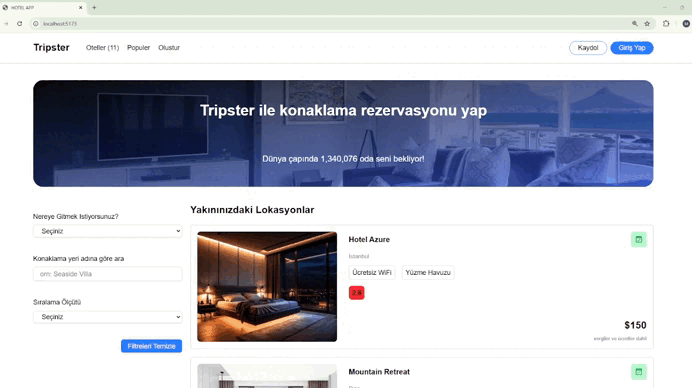

# 🚀 Hotels Application.. 
In this project, I combined the most efficient tools in the TypeScript and React ecosystem!
I enhanced development safety and predictability by implementing TypeScript with React. By adding TypeScript's static typing features to React's power, I can catch errors early in the development phase.

 # Key Improvements:
💡 Optimized server state management with TanStack Query
Automatic cache management
Background data fetching
Optimistic updates
Real-time data sync

💡 Strengthened form handling with Formik + Yup integration
Easy form validation
Dynamic error handling
Form state control
Schema-based validation

# 💡Basic Tech Stack:
Vite for fast bundling

React with TypeScript

Axios for HTTP requests

Redux Toolkit

React Router DOM

TanStack Query

Formik & Yup

Tailwind CSS

Note: While Formik and Yup make form validations much more manageable, TanStack Query's caching and optimistic updates significantly improve the user experience.

# Preview of the Project

